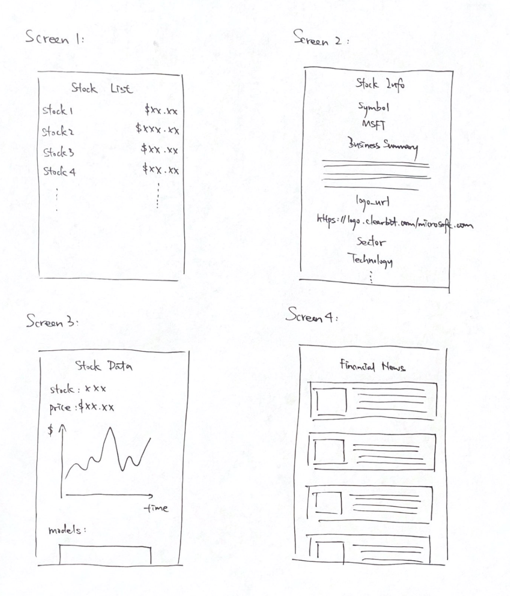

# An iOS Mobile App called FinancialProject
Alice Wang (mengw3) | Moderator: Srivathsan Subramanian(ss4)

This is an iOS mobile app about US stock market for CS242

## Abstract
### Project Purpose
This app can help users get more information about stock market, including stock price, trendlines, news, financial reports, etc.

### Project Motivation
Since my major is Computer Science & Economics, I want to use my computer science knowledge to make financial analysis process be more accurate and automated. This app can provide key information for people who do not have any financial knowledge, and help them make investment in stock market.

## Technical Specification
- Platform: Cross-platform app (React Native)
- Programming Languages: JavaScript & Python
- Stylistic Conventions: JavaScript Style Guide & Python Style Guide
- SDK: facebook SDK
- IDE: Visual Studio Code, PyCharm
- Tools/Interfaces: Mobile devices
- Target Audience: people who want to invest in stocks

## Sketch

## Functional Specification
### Features
- It has feature 1: real-time price of all stocks
- It has feature 2: basic info of each stock
- It has feature 3: stock charts and models for technical analysis
- It has feature 4: financial news and financial reports

### Scope of the project
- Limitations: users only can use this app for gathering information of each stock, not for trading.

## Brief Timeline
### Week 1: finishing backend data setup
- Part 1: Get Data  
Use API (e.g. Yahoo Finance) to get stock data and general info of each stock.  
Stock data can export as a .csv file.  
- Part 2: API Creation
Get:  
http://127.0.0.1:5000/api/stock_info?stock_name={stock_name}  
Get stock's general info with stock name.  
e.g. http://127.0.0.1:5000/api/stock_info?stock_name=AAPL  
http://127.0.0.1:5000/api/stock_data?stock_name={stock_name}&stock_period={stock_period}  
Get stock historical data with stock name and stock period.  
e.g. http://127.0.0.1:5000/api/stock_data?stock_name=MSFT&stock_period=5d  
- Part 3: Create an iOS app with four screens, and set up navigation between screens.  
(These four screens can only have title this week)  
Screen 1: a list of all stocks with real-time price.  
Screen 2: present stock's general info, including symbol, business summary, logo url, sector, industry, etc.  
Screen 3: present historical data and stock chart for one specific stock.  
Screen 4: present financial models for one specific stock.  
Screen 5: present financial news and financial reports.  
### Week 2: rendering stock's general info and historical data
- Part 1: Stock List  
At screen 1, present a list of all stocks with real-time price.  
- Part 2: Data Visualization - stock info  
At screen 2, use api http://127.0.0.1:5000/api/stock_info?stock_name={stock_name} get info.  
Present general info for one specific stock.  
- Part 3: Data Visualization - stock historical data  
At screen 3, use api http://127.0.0.1:5000/api/stock_data?stock_name={stock_name}&stock_period={stock_period} get data  
Present historical data for one specific stock. (In this week, only present list of raw data is fine)  
### Week 3: finishing navigation and rendering financial news and financial reports.
- Part 1: Navigation  
Let screen 2 and screen 3 change according to selecting different stock.  
- Part 2: Chart View  
At screen 3, use chart to present stock's historical data.  
- Part 3: Financial Models  
At screen 4, add financial models to analyze stock's historical data.  
- Part 4: News & Reports  
At backend, create an api and return financial news in json format:  
Get:  
http://127.0.0.1:5000/api/financial_news  
At screen 5, use api http://127.0.0.1:5000/api/financial_news and present news by using Flatlist.
Create a button for each news that enable users can jump to news page and read more details.

## Rubrics
### Week 1
| Category  | Total Score Allocated | Detailed Rubrics                                                            |
|-----------|:---------:|-------------------------------------------------------------------------------|
|  Fetching data from API |  6  |  0: Didn't implement anything   2: Only get real-time price   4: Get stock's genreal info   5: Get stock's general info and historical price   6: Get stock's general info and historical price with  name and period: 1d, 5d, 1mo, 3mo, 6mo, 1y, 2y, 5y, 10y, ytd, max |
|  API creation |  2  |  1 point for each API |
|  Export data as CSV |  2  |  0: Didn't implement anything   2: completed function |
|  Layout Design |  2  |  0: Didn't implement anything   2: Presented diagrams/drawings of app design |
|  View Layer |  3  |  0: Didn't implement anything   3: Navigation between screens (each screen can be blank at this time) |
|  API Unit tests |  2  |  1 point for each API test, 2 API totally |
|  Snapshot tests |  4  |  0 pts if there are no tests   1 point for each screen |
|  Manual Test Plan |  4  |  0: there are no manual test plan   1: the test plans include only environment setup OR scenario descriptions   2: test plans that coverd 50% required functions   3: test plans that coverd 75% required functions   4: well-composed test plans covering all required functions |

### Week 2
| Category  | Total Score Allocated | Detailed Rubrics                                                            |
|-----------|:---------:|-------------------------------------------------------------------------------|
|  Fetching data from API |  2  |  0: Didn't implement anything   1 point for each successful fetch, 2 totally |
|  Present all stocks and real-time price on screen1 |  4  |  0: Didn't implement anything   2: Only have stocks' name   4: Have stocks' name and their real-time price |
|  Data Visualization - stock info |  4  |  0: Didn't implement anything   2: Get data of each stock's general   4: finish visualization |
|  Data Visualization - stock historical data |  4  |  0: Didn't implement anything   2: Get data of each stock's historical price   4: finish visualization |
|  View Layer |  1  |  0: Didn't implement anything   1: nice looking and easy to navigate |
|  Snapshot tests |  4  |  0 pts if there are no tests   1 point for each screen |
|  Manual Test Plan |  6  |  0: there are no manual test plan   1: the test plans include only environment setup OR scenario descriptions   2: test plans that coverd 50% required functions   4: test plans that coverd 75% required functions   6: well-composed test plans covering all required functions |

### Week 3
| Category  | Total Score Allocated | Detailed Rubrics                                                            |
|-----------|:---------:|-------------------------------------------------------------------------------|
|  Navigation |  4  |  0: Didn't implement anything   2: One of screen 2 & 3 can change according to selecting different stock   4: Screen 2 & 3 can change according to selecting different stock |
|  Chart View |  2  |  0: Didn't implement anything   2: only can present raw data   2: use line chart to present stock's historical data |
|  Financial Models |  4  |  0: Didn't implement anything   3: have one model for analyzing stock valuation   4: have more than one models for analyzing stock valuation |
|  Web Scraping / API |  1  |  0: Didn't implement anything   1: get data of recent financial news or financial reports |
|  News and Reports |  4  |  0: Didn't implement anything   1: Only have title on screen 4   2: Have a list of financial news (only have title and link)   3: Have a list of financial news with title, link and summary   4: Have a list of financial news with title, link and summary. Each news is clickable, and can jump to its original webpage |
|  API Unit tests |  2  |  test api for financial news |
|  Manual Test Plan |  8  |  0: there are no manual test plan   2: the test plans include only environment setup OR scenario descriptions   4: test plans that coverd 50% required functions   6: test plans that coverd 75% required functions   8: well-composed test plans covering all required functions |
